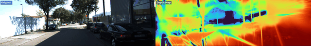
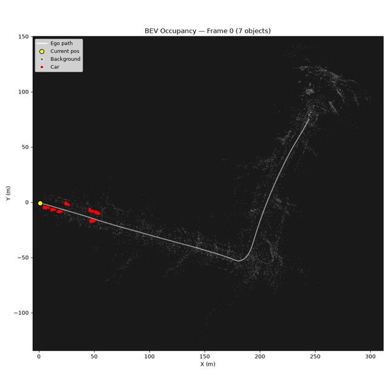
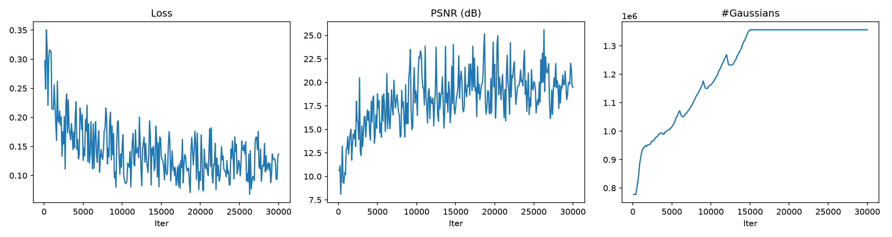
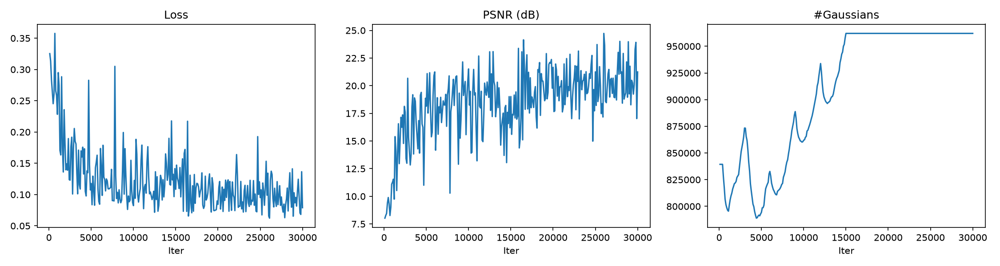

# Street Gaussians

From-scratch implementation of dynamic 3D Gaussian Splatting for street scenes. Splits a driving scene into background + per-object Gaussian models using LiDAR and tracking labels, composes them per frame with rigid transforms, and trains with gsplat.

The decomposed representation lets you remove objects, move them around, freeze time, or render from new viewpoints — all without retraining.

Built from scratch using only gsplat for CUDA rasterization:
- Per-object gradient routing and independent adaptive density control
- 9 scene manipulation demos (removal, recomposition, temporal interpolation, etc.)
- Config-driven pipeline with plug-and-play data source registry
- CPU smoke test suite — validates the full pipeline without GPU or real data

<p align="center">
  
</p>

## Results

KITTI Tracking, 30K iterations, A100.

- **Seq 0001** — 447 frames, suburban road with moderate traffic
- **Seq 0020** — 837 frames, highway with dense traffic and 127 tracked objects
- Monocular only (single front-facing camera) — limited multi-view coverage per object

| | Seq 0001 | Seq 0020 |
|--|----------|----------|
| PSNR (test) | 19.63 dB | 20.59 dB |
| SSIM (test) | 0.6379 | 0.7354 |
| LPIPS (test) | 0.4757 | 0.4899 |
| Gaussians | 1.36M | 962K |
| Objects | 97 | 127 |
| Time | ~24 min | ~27 min |

## Demos (Seq 0001)

**1. Replay** — GT vs rendered, all frames
<p align="center"></p>

**2. Object Removal** — largest tracked object removed
<p align="center"></p>

**3. Novel Viewpoint** — camera shifted to unseen position
<p align="center"></p>

**4. Background Only** — all dynamic objects stripped
<p align="center"></p>

**5. Freeze Frame** — camera orbits a frozen timestamp
<p align="center"></p>

**6. Scene Recomposition** — object moved to a new position
<p align="center"></p>

**7. Depth Map** — dense depth from Gaussian z-values
<p align="center"></p>

**8. BEV Occupancy** — top-down tracking with ego trajectory
<p align="center"></p>

**9. Temporal Interpolation** — 5x slow motion via quaternion slerp
<p align="center"></p>

## Training Curves

**Seq 0001** (30K iters)
<p align="center"></p>

**Seq 0020** (30K iters)
<p align="center"></p>

## How it works

```
LiDAR + 3D Tracking Labels
        |
Scene Decomposition (point-in-box)
        |
Background + N Object PointClouds
        |
Init Gaussians (KNN scale, SH coeffs)
        |
Training (30K iters)
  compose_frame → gsplat render → L1+SSIM loss
  per-component ADC (densify/prune)
        |
Eval + 9 Demo Videos
```

Each object's Gaussians live in a local frame. At render time, they're rigidly transformed to world coordinates and concatenated with the background before rasterization. Gradients are routed back to each component separately so ADC works per-object.

## Project structure

```
street_gaussians/
├── config/          # Dataclasses + YAML loader
├── data/            # DataSource registry + KITTI loader
├── models/          # Quat math, Gaussian ops, scene composition
├── preprocessing/   # LiDAR → bg/object point clouds
├── training/        # Loss, optimizer, ADC, training loop
├── rendering/       # gsplat wrapper, 9 demo renderers
├── evaluation/      # PSNR/SSIM/LPIPS, profiler
└── utils/           # Logger, checkpoints, video
```

## Usage

```bash
pip install -r requirements.txt

# Smoke test (CPU, no data needed)
python scripts/smoke_test.py

# Train
python scripts/train.py --config configs/default.yaml

# Render demos
python scripts/render.py --config configs/default.yaml \
    --checkpoint output/checkpoint_030000.pt --demos all
```

Override any config value with a second YAML:
```bash
python scripts/train.py --config configs/default.yaml --overrides configs/kitti_0001.yaml
```

## What I learned

1. **Coordinate transforms took longer than the training loop.** KITTI has four coordinate frames. The full IMU-to-camera chain (`R_rect @ Tr_velo_cam @ Tr_imu_velo`) has to be exactly right — one wrong transpose and your renders look fine but the geometry is silently broken.

2. **25M points will OOM your A100.** Accumulating LiDAR across all frames and then computing KNN distances naively blows up. Batched KNN in 10K chunks and capping background at 200K points was the fix.

3. **Bad decomposition can't be trained away.** If a car's LiDAR points leak into the background, it becomes a ghost frozen in place forever. The point-in-box step has to be airtight.

4. **Highway scenes are the worst case.** 127 tracked objects on seq 0020 means each car gets very few Gaussians and limited viewing angles. Suburban scenes with 10-20 objects look way better.

5. **Smoke test before GPU.** CUDA/CPU tensor mismatches, missing ffmpeg, odd-pixel-dimension crashes — all discovered on a GPU pod after uploading. A synthetic-data CPU test catches most of these locally for free.

## Requirements

- Python 3.10+
- PyTorch 2.1+
- [gsplat](https://github.com/nerfstudio-project/gsplat) 1.0+
- CUDA GPU (tested on A100 via [RunPod](https://www.runpod.io/))
- ffmpeg (optional, for video encoding)

## References

- Kerbl et al., [3D Gaussian Splatting for Real-Time Radiance Field Rendering](https://repo-sam.inria.fr/fungraph/3d-gaussian-splatting/), SIGGRAPH 2023
- Yan et al., [Street Gaussians for Modeling Dynamic Urban Scenes](https://zju3dv.github.io/street_gaussians/), ECCV 2024
- [KITTI Tracking Benchmark](https://www.cvlibs.net/datasets/kitti/eval_tracking.php) — Geiger et al.
- [gsplat](https://github.com/nerfstudio-project/gsplat) — CUDA Gaussian rasterization library

## Author

**Kirubhakaran Meenakshi Sundaram**

[LinkedIn](https://www.linkedin.com/in/kirubhakaranm/) | [Portfolio](https://kirubhakaranm.github.io/)
